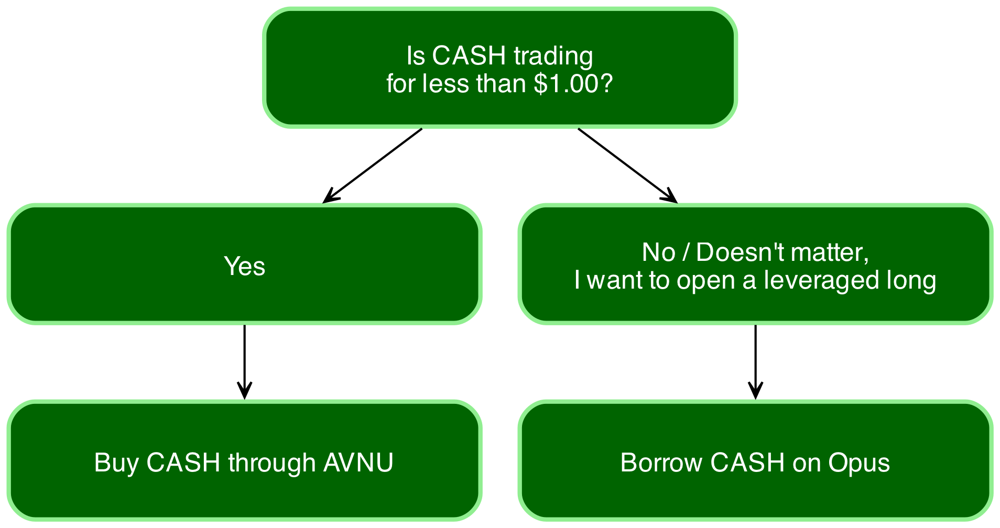

# Meet Opus and CASH

Opus is a cross margin autonomous Decentralized Digital Bank (DDB)—our ode to personal sovereignty—the rejection of centralization of power, of the byzantine fiat system.

Opus doesn’t provide Forward Guidance only to pivot at the last second leaving debt owners holding the bag. Its monetary policy is not dictated behind closed doors by bureaucrats in DC or DAO politicians. Not even by me or you. It’s fully autonomous.

It lets you borrow against a portfolio of carefully curated collateral including yield-bearing assets. With minimal human intervention, the interest rates, maximum loan-to-value ratios and liquidation thresholds are dynamically determined by each user's collateral profile.

Our first digital asset is CASH, an algorithmic overcollateralized stablecoin soft pegged to the US dollar.

## How is CASH different from other stablecoins?

Opus introduces novel mechanisms that provide stronger stability guarantees to ensure that CASH is pegged to the value of USD.

1. A global [multiplier](peg-stability.md#how-does-the-multiplier-work) is applied to increase or decrease interest rates across the board, depending on whether the spot market price of CASH is below or above peg.
2. A [forge fee](peg-stability.md#how-do-forge-fees-work) is charged on minting of new debt when the spot market price of CASH is below peg.
3. … and a lot more for those with eyes to see!

## What can I do with CASH?

A stable peg is cool, but a stablecoin is only as useful as what it enables its holders to do. Even though there are novel use cases coming to Opus, here’s what you can do TODAY:


Let us know if you would like any of these use cases to be fully automated!


* **<1.0x exposure to any token**

Simply open a credit line against your portfolio and swap CASH for any token using [AVNU](https://www.avnu.fi/).

* **Leveraged exposure to any supported token**

By borrowing against your portfolio it is possible to construct a multicall that adds collateral, flash mints CASH, swaps it for an Opus supported token like STRK, and adds it as collateral. Your maximum leverage is limited by the LTV threshold of your trove—and as you know, these are unique to you. You can calculate it with the formula $$\frac{1}{1 - \text{LTV Threshold}}$$.

* **Offramp to cover real life expenses**

Opus’ deep USDC liquidity allows for low slippage swaps between CASH and USDC. As a centralized stablecoin, USDC can be easily offramped via Coinbase, Kraken, and other renowned exchanges.

As demand for CASH grows, the DAO will move to establish direct CASH↔USD ramps to minimize existing friction and slippage.

## What can I do on Opus?

1. [Borrow](borrowing.md) CASH against a set of whitelisted collateral by opening a Trove
2. [Provide](liquidations.md#why-should-i-deposit-cash-to-the-absorber) CASH to the Absorber to participate in liquidations and receive liquidated assets and a share of the protocol's income from accrued interest and fees
3. Secure Opus by [liquidating](liquidations.md#what-are-the-incentives-to-perform-a-searcher-liquidation) unhealthy Troves yourself or by using the Absorber's liquidity and be compensated
4. Provide liquidity to the CASH-EKUBO [pool](https://app.ekubo.org/positions/new?quoteCurrency=USDC\&baseCurrency=CASH\&tickLower=-27641000\&tickUpper=-27626000\&tickSpacing=20\&fee=6805647338418769825990228293189632) on Ekubo, and stake the LP on Opus to receive a share of the protocol's income from accrued interest and fees, on top of the underlying swap fees.

## How to get CASH?

There are currently two ways to acquire CASH:

1. Buy it spot by swapping any token for it through [AVNU](https://www.avnu.fi/)
2. Open a CASH credit line on Opus (and earn participation rewards for your loyalty)

> Should I buy, or should I open a credit line on Opus?

<figure><picture><source srcset=".gitbook/assets/decision_tree (1).png" media="(prefers-color-scheme: dark)"></picture><figcaption></figcaption></figure>


To interact with Opus or use CASH, you need a Starknet-compatible wallet (e.g. ArgentX, Braavos).


Interested in borrowing?

<table data-view="cards"><thead><tr><th></th><th></th><th></th><th data-hidden data-card-target data-type="content-ref"></th><th data-hidden data-card-cover data-type="files"></th></tr></thead><tbody><tr><td>Borrowing CASH →</td><td></td><td></td><td><a href="borrowing.md">borrowing.md</a></td><td><a href=".gitbook/assets/covertest.png">covertest.png</a></td></tr></tbody></table>

Otherwise, read about how you can earn STRK rewards by borrowing on Opus!
